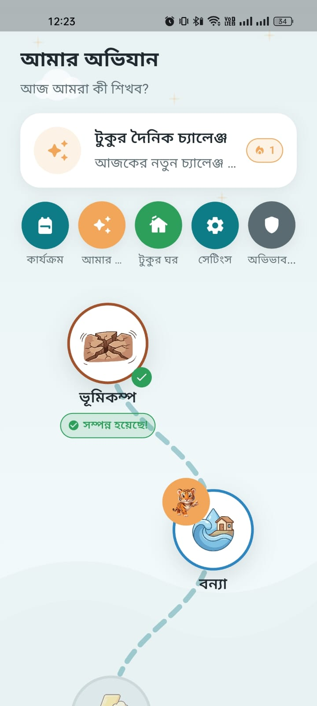
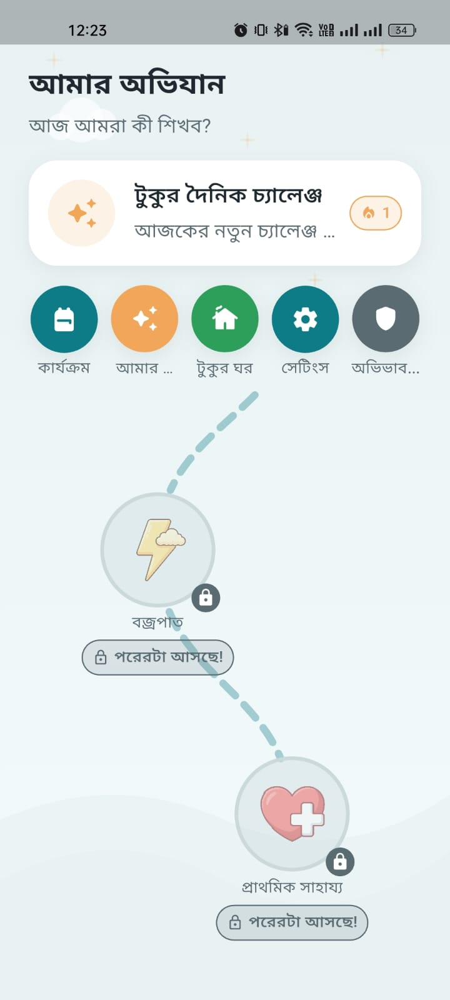
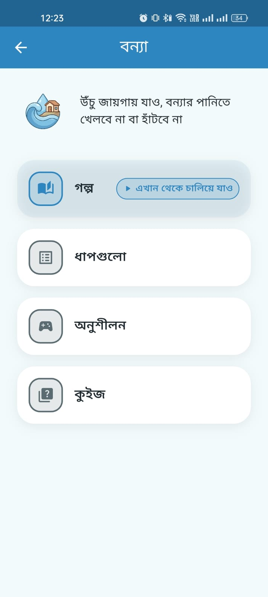
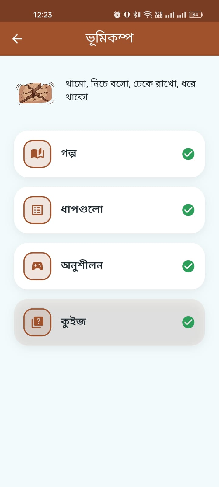
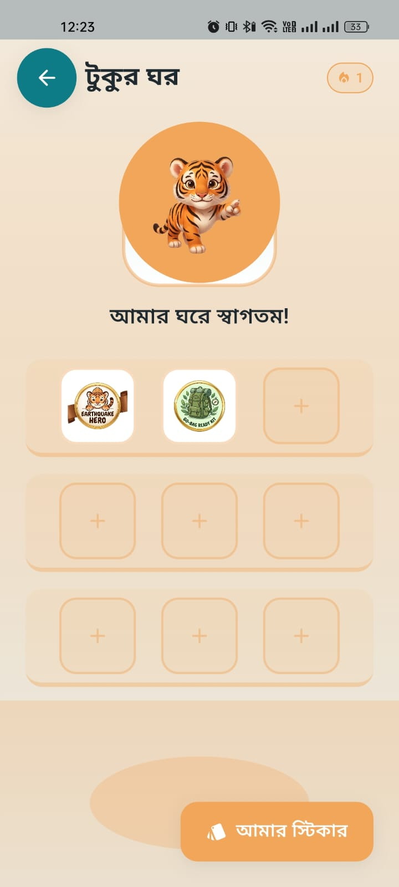
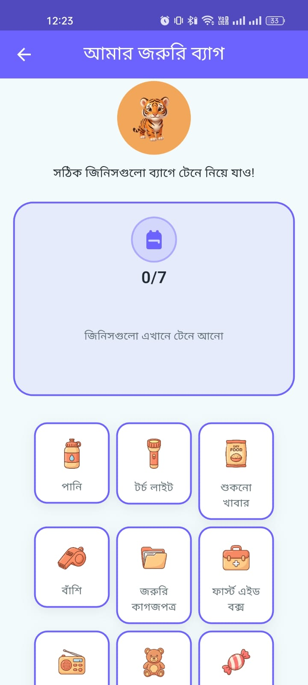
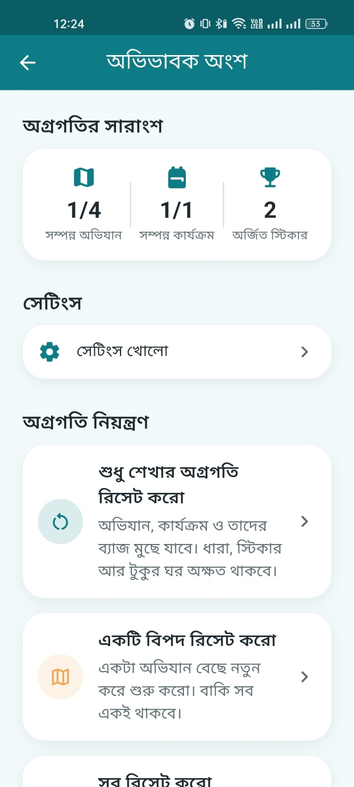
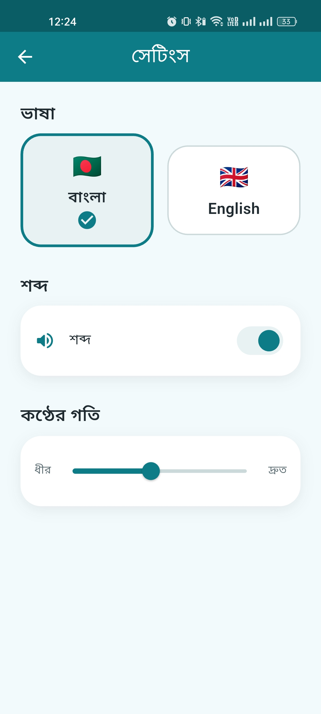

# Bipod Bondhu — বিপদ বন্ধু

A free, bilingual (Bangla/English) disaster-preparedness app that teaches
children how to stay safe before, during, and after the hazards they're
actually likely to face — **earthquake, flood, lightning** — plus a
**first aid / "helper"** module, through short, playful, narrated
lessons rather than a wall of text.

## Who it's for

- **Kids** (primary users) — the whole experience is built around a young
  child using the app mostly on their own: big tap targets, narrated
  Bangla/English text, a friendly tiger-cub mascot ("Tuku") who reacts
  warmly, no reading-heavy screens, no fail states, no timers or pressure.
- **Parents/guardians** (secondary users) — a math-gated "Parent Zone"
  gives grown-ups a progress summary and the ability to reset a child's
  progress (one adventure, just the learning progress, or a full fresh
  start), without a young child being able to wander in and erase things
  by accident.

The tone throughout is calm and encouraging, never scary or guilt-inducing
— the goal is confidence, not fear.

## Screenshots

| Adventure Map | Adventure Map (locked stops) | Module in progress |
|---|---|---|
|  |  |  |

| Module completed | Tuku's Den | Emergency Kit Builder |
|---|---|---|
|  |  |  |

| Parent Zone | Settings |
|---|---|
|  |  |

## What the app is built from

Each hazard module teaches the same simple beat: **Story → Steps →
Practice → Quiz → Reward**. A child hears/reads what the hazard is and
why it matters, sees the concrete safe actions, practices them in a small
interactive game, checks their understanding with a quiz, and finishes
with a badge — real, positive reinforcement for finishing, not a score to
fail.

## The flow

**First run**
Splash (Tuku intro) → language picker (বাংলা / English) → Adventure Map.

**The Adventure Map (home screen)**
A winding path of hazard "stops" — Earthquake and Flood open from the
start; each next module unlocks once the one before it is completed, with
First Aid ("Helper Hero") last since it depends on the others being done.
The map header also carries:
- **Tuku's Daily Challenge** — a quick daily quiz/practice pulled from
  everything the child has already learned, building a **streak** (with a
  couple of forgiving "freezes" so one missed day doesn't erase progress).
- **Tuku's Den** — the child's own room, where every badge/sticker they've
  earned can be dragged onto a shelf and arranged; a small dot shows when
  a freshly-earned sticker is still waiting to be placed.
- **Activities** — cross-cutting, module-independent mini-games (e.g. the
  Emergency Kit Builder: drag the right items into a go-bag).
- **My Stickers** — a book of every badge earned so far.
- **Parent Zone** — behind a simple "solve this to continue" gate for
  grown-ups only.

**Finishing a module**
Completing every beat of a hazard triggers a confetti reward screen and
awards that module's badge, with a gentle invite to go place the new
sticker in Tuku's Den — never forced, always skippable.

**Tuku's Den (the daily "home base")**
Earned stickers live in a tray; dragging one onto a shelf slot displays it
in the room, which also has a couple of free wall/theme choices. Nothing
here is random or purchasable — every sticker is earned transparently
through learning.

**Parent Zone**
Reached via a quick arithmetic gate (keeps small children out, not meant
to stop an adult). Shows real progress (adventures/activities completed,
badges earned) and, under "Manage Progress," three clearly-described,
confirmation-gated resets: reset one hazard, reset learning progress only
(keeping the streak/stickers/Den), or reset everything for a brand-new
child — the last one requires an extra press-and-hold confirmation since
it can't be undone.

## Stack

Flutter · GetX (state + routing) · Clean Architecture (`core / data /
domain / presentation`) · Floor (local SQLite persistence) ·
flutter_screenutil (responsive sizing) · Bangla + English localization.

## Running it

```bash
flutter pub get
dart run build_runner build --delete-conflicting-outputs
flutter run
```

### Bangla font (recommended)
Download **Hind Siliguri** (Google Fonts, free), put the 4 `.ttf` files in
`assets/fonts/`, then uncomment the `fonts:` block in `pubspec.yaml`.

See `ASSETS.md` for the full asset manifest (every image the app expects,
and where to drop real art in as it's made).
